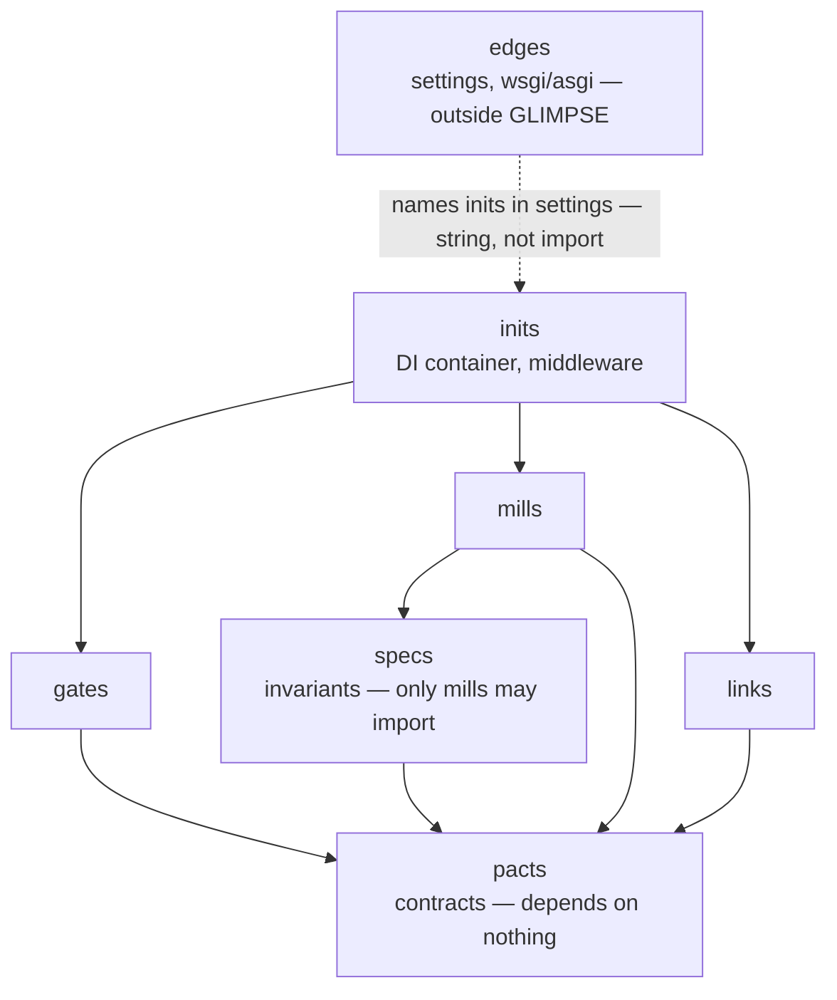

# Layers Overview

GLIMPSE defines seven layers: six inner layers, each with a single
responsibility and a fixed set of allowed dependencies, plus `edges` — the
framework shell outside the import rules.

## Dependency diagram



Arrows point in the direction of dependency (A → B means A imports B), with
one exception: `edges → inits` is configuration, not import — settings name
the middleware by dotted string, and nothing ever imports `edges`.

`gates`, `mills`, and `links` are siblings that never import each other, and
`pacts` is the only layer any of them may reach. Everything they need from one
another arrives as a protocol implemented elsewhere and passed in. `inits` is
the single place the three meet — it holds the concrete classes, builds the
object graph, and hands each side what it was promised.

`inits → gates` is port-dependent. `inits` is the composition root and the
only layer that may import `gates`. Where the framework dispatches to entry
points itself (web), `inits` never needs to — middleware attaches the
container to the request, and the arrow is injection, not import. Where
nothing dispatches (CLI), `inits` imports the gate classes and composes them
directly.

`specs` sits between `mills` and `pacts` and has exactly one consumer. `links`,
`gates`, and `inits` must never import it — a constant they need is either a
contract (`pacts`) or configuration, which
[enters at `inits`](inits.md#configuration-enters-here).

## Layer summary

| Layer | Purpose | Depends on | Imported by |
| --- | --- | --- | --- |
| [pacts](pacts.md) | Protocols, DTOs, errors, enums, TypedDicts | nothing | everything |
| [specs](specs.md) | Business invariants (pure constants, no IO) | pacts | mills only |
| [mills](mills.md) | Business logic and services | pacts + specs | inits |
| [links](links.md) | Repositories, external clients | pacts + ORM | inits |
| [gates](gates.md) | Views, forms, URLs, templatetags, CLI commands | pacts | inits (CLI composition only) |
| [inits](inits.md) | DI container, middleware — wires links into gates | pacts + mills + links (+ gates in CLI) + framework glue | nothing — `edges` names it in configuration |
| [edges](edges.md) | settings, wsgi/asgi, manage.py | outside GLIMPSE | nothing |

## Package or module?

`pacts`, `specs`, and `mills` are sliced by noun — and on day one you have one
`mills.py` and no reason to plan further. (`pacts` also holds port and wiring
contracts in their own modules — see the [placement
algorithm](pacts.md#slicing-axis).) `inits` has no axis to get right — it stays
thin, so split it however is convenient. All four begin as single modules
(`mills.py`) and are promoted to packages (`mills/`) when they earn it.

`links` and `gates` are packages from day one. Their first axis is the **port**,
and the port is knowable before a line of code is written: you know you are
building a CLI, you know you are talking to a database. Skipping the axis means
renaming every import the day a second adapter arrives.

```text
myproject/
├── pacts.py
├── specs.py
├── mills.py
├── inits.py
├── links/
│   └── db/
│       └── sqlite.py
├── gates/
│   └── cli/
│       └── argparse.py
└── edges/
    └── __init__.py       # empty until a framework fills it
```

`edges/` is there and empty. A CLI has nothing to put in it — the runtime
reaches `inits` by dotted string in `pyproject.toml` — but the [import
contracts](../guides/import-linter.md) are taken as a set on the first commit,
and a contract can only name a module that exists.

See [Growing rules](../slicing/growing.md) for what triggers the promotion.

## Keep `__init__.py` empty

The default is an empty `__init__.py`, with every symbol imported from the
module that defines it — `from pkg.foo.bar import Bar`, not `from pkg.foo import
Bar`.

A facade `__init__.py` that re-exports a public surface is allowed only for:

- a framework or public-API package whose inner layout is an implementation
  detail (the [`links` adapter facade](links.md#the-facade))
- relief from line-length pressure
- a pre-existing legacy facade

It is not the default.
