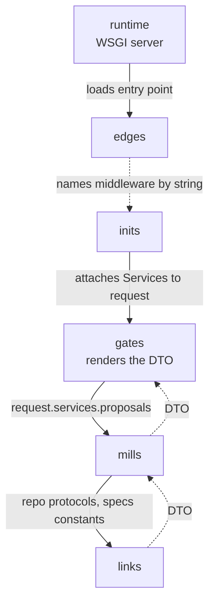

# Request Lifecycle

One HTTP request, traced through every layer. A CLI command follows the same
shape with a different opening: nothing in `edges`, no middleware —
`pyproject.toml` names `inits` by dotted string, and `inits` constructs the
gate directly, injecting the mills into its constructor.

## The trace

## Step by step

1. **The runtime invokes `edges`.** A WSGI server loads `edges/wsgi.py`; nothing
   in the codebase imports `edges`. Settings list
   `myproject.inits.ServicesMiddleware` as a dotted string — configuration, not
   an import.
2. **`inits` builds the object graph.** Per request, the middleware constructs
   `Services()` — which builds its own `Repositories()` — and attaches it to
   the request. Every leaf is a `@cached_property`, so only what the request
   touches gets built.
3. **A gate handles the request.** The handler types the request as
   `RootRequest` — the gate-local typing subclass — and calls
   `request.services.proposals.get(pk)`. Its only project import is `pacts`:
   nothing from `mills`, `links`, or `inits`.
4. **A mill runs the business rule.** The service sees repository protocols from
   `pacts` and constants from `specs`. If it writes to more than one repository,
   it opens `transaction.atomic()` itself — the gate never does.
5. **A link touches the store.** The repository queries the ORM and returns a
   DTO. The ORM instance never leaves the adapter.
6. **The gate renders the DTO.** Template, serializer, or stdout — always the
   `pacts` shape, never a model.

Six layers, one straight line, every arrow checked by [importlinter](../guides/import-linter.md).
